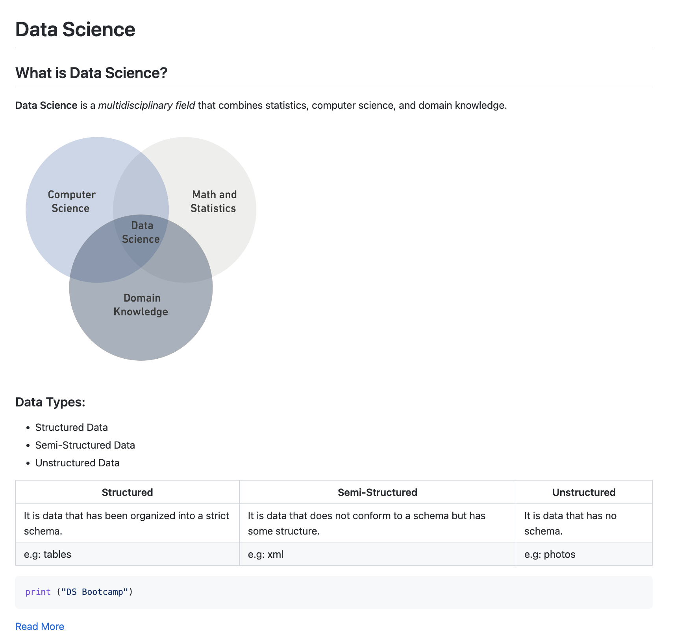

# Data Science

## What is Data Science?


<b> Data Science is the science of extracting userful insights from data using data science methodologies. </b>


```python
print('hi ya\'ll')
```

    hi ya'll


### Data Types

* <u>Strings:</u> Written in quotation marks.
* <u>Lists:</u> contain lists of items in strings, bools, or numbers, and are mutable. Written between two brackets. 
* <u>Tuples:</u> contain immutable items but they are iteratble. They are often between two parantheses. 
* <u>Dictionariess:</u> contain keys and values and written in curly brackets. 
* <u>bool:</u> True or False values. Also, True is 1, and False is 0. 
* <u>numbers:</u> are integers floats orr decimals or complex. 


_Multidisciplinary field_




* <u>Strings:</u> Written in quotation marks.
* <u>Lists:</u> contain lists of items in strings, bools, or numbers, and are mutable. Written between two brackets. 
* <u>Tuples:</u> contain immutable items but they are iteratble. They are often between two parantheses. 
* <u>Dictionariess:</u> contain keys and values and written in curly brackets. 
* <u>bool:</u> True or False values. Also, True is 1, and False is 0. 
* <u>numbers:</u> are integers floats orr decimals or complex. 


```python
print ("DS Bootcamp")
```

    DS Bootcamp


```python

```
